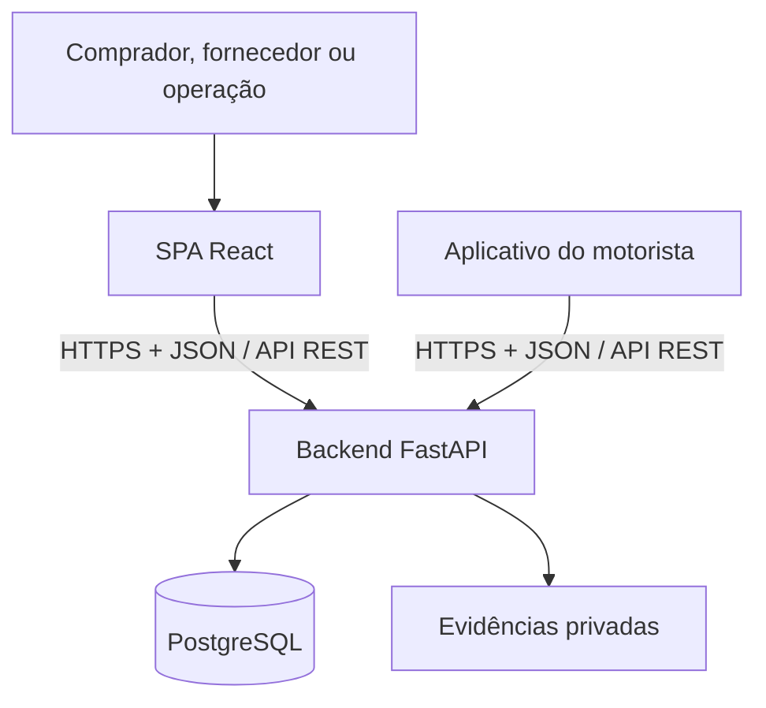

# RotaLog Frontend

Portal web responsivo do **RotaLog**, utilizado por empresas compradoras, fornecedores/distribuidoras e operadores da plataforma para acompanhar e executar as jornadas comerciais e logísticas do marketplace B2B.

> **Estado atual:** o repositório contém o skeleton inicial em React, TypeScript e Vite. As funcionalidades e dependências marcadas como planejadas serão incorporadas conforme os grupos de entrega do Backlog.

## Para quem é o portal

- **Comprador:** consulta catálogo, compara ofertas, realiza checkout e acompanha pedidos, pagamentos, entregas e contestações.
- **Fornecedor:** administra ofertas, estoque e capacidade; aceita pedidos; registra separação, prontidão e retornos.
- **Operação RotaLog:** planeja e publica rotas, acompanha exceções, provas pendentes, disputas, jobs e auditoria.
- **Perfis administrativos:** gerenciam organizações e ações autorizadas conforme papéis e capacidades definidos pelo backend.

## Responsabilidades

- oferecer jornadas responsivas e acessíveis para os diferentes perfis;
- consumir a API REST do backend sem acessar banco ou arquivos diretamente;
- apresentar separadamente estados comerciais, financeiros, de custódia e de disputa;
- tratar loading, vazio, erro recuperável e falta de permissão;
- confirmar ações críticas e impedir reenvios acidentais;
- exibir contadores com horário absoluto, fuso e tempo restante;
- carregar evidências privadas somente sob demanda e mediante autorização;
- sinalizar claramente dados sintéticos e ações simuladas;
- manter os tipos de integração compatíveis com o OpenAPI canônico.

## Arquitetura e comunicação



O frontend e o mobile não se comunicam diretamente. Eles observam o mesmo fluxo por meio da API:

1. o portal cria ou atualiza pedidos, rotas e decisões autorizadas;
2. o backend valida as regras e persiste a mudança;
3. o aplicativo do motorista consulta rotas e envia tentativas/provas;
4. o portal consulta o estado consolidado e a timeline autorizada.

O OpenAPI do backend é o contrato canônico. O portal deve utilizar tipos gerados e um wrapper HTTP fino quando essa etapa estiver implementada. A baseline usa HTTP; WebSocket não é requisito da demonstração.

## Funcionalidades previstas

### Comprador

- login e seleção de organização;
- catálogo, busca, filtros e comparação de ofertas;
- carrinho de um fornecedor, checkout e pagamento simulado;
- lista e detalhe de pedidos;
- acompanhamento de entrega, retorno, reentrega e reembolso;
- abertura de contestação e acompanhamento da decisão.

### Fornecedor

- administração de ofertas, estoque declarado e capacidade;
- fila de pedidos, aceite, recusa e prazos;
- separação, prontidão e falha pré-despacho;
- recebimento e conferência de retornos;
- resposta a contestações e acompanhamento financeiro.

### Operação RotaLog

- criação, edição e publicação de rotas;
- painel de organizações, notificações e jobs falhos;
- tratamento de prova pendente, cancelamento excepcional e extravio;
- mediação, decisão provisória, revisão e resultado final;
- timeline e auditoria mascarada;
- controle dos cenários sintéticos da demonstração.

No piloto, o portal adicionará compra multi-fornecedor, operações parciais, integração ERP, propostas de rota otimizadas e mapa de rastreamento autorizado.

## Stack

### Presente no repositório

| Área | Tecnologia |
|---|---|
| Linguagem | TypeScript 6 em modo estrito |
| UI | React 19 |
| Build e desenvolvimento | Vite 8 |
| Rotas | React Router 7 |
| Qualidade estática | Oxlint |
| Compilação | React Compiler |
| Gerenciador de pacotes | npm com `package-lock.json` |

### Baseline planejada

- TanStack Query para estado remoto;
- React Hook Form e Zod para formulários e validação de fronteira;
- shadcn/ui sobre Radix UI;
- Tailwind CSS;
- Vitest e Testing Library;
- Playwright para jornadas ponta a ponta;
- tipos e cliente gerados a partir do OpenAPI do backend.

TanStack Table só será adicionado se as telas administrativas exigirem seleção, ordenação ou colunas complexas. Next.js não faz parte da arquitetura: o portal é uma SPA autenticada sem necessidade de SSR ou SEO relevante.

## Organização prevista

```text
src/
  app/          # router, providers e bootstrap
  features/     # auth, catalog, checkout, orders, routes, disputes e demo
  shared/       # UI, cliente API, validação e utilidades
```

Evite criar uma camada `entities` que apenas replique os tipos gerados pelo OpenAPI ou os modelos específicos de cada feature.

## Requisitos locais

- Git;
- Node.js **20.19+** ou **22.12+**;
- npm, utilizando o lockfile versionado;
- backend em execução quando a integração HTTP estiver habilitada.

## Configuração e execução local

```bash
git clone https://github.com/Uninorte-Extensao/rotalog-frontend.git
cd rotalog-frontend

npm ci
npm run dev
```

O Vite exibirá no terminal o endereço local, normalmente `http://localhost:5173`.

Comandos disponíveis:

```bash
npm run dev      # servidor de desenvolvimento com HMR
npm run build    # type check e build de produção
npm run lint     # análise estática com Oxlint
npm run preview  # prévia local do build gerado
```

Quando a integração da API for adicionada, a URL do backend deverá ser definida por configuração de ambiente do Vite, sem credenciais no bundle. Mantenha os nomes efetivamente adotados documentados em um `.env.example`.

## Regras de UX e segurança

- o backend é a autoridade final para permissões e ações permitidas;
- `allowed_actions` pode orientar a interface, mas nunca substitui autorização;
- botões de comando ficam desabilitados após o envio;
- ações relevantes exigem confirmação explícita;
- prova pendente não deve parecer uma entrega concluída;
- resultado provisório não deve parecer definitivo;
- cor não pode ser o único indicador de estado;
- dados sensíveis, tokens e evidências não devem ser registrados no console;
- o portal deve ser responsivo a partir de 360 px, com operação priorizando desktop;
- as jornadas principais devem buscar conformidade WCAG 2.2 AA.

## Repositórios relacionados

- Backend: https://github.com/Uninorte-Extensao/rotalog-backend
- Frontend: https://github.com/Uninorte-Extensao/rotalog-frontend
- Mobile: https://github.com/Uninorte-Extensao/rotalog-mobile
- Board de implementação: https://trello.com/b/4NmXZdXn/rotalog

## Contribuição

1. Escolha uma task no Backlog e confirme o grupo de entrega.
2. Verifique se o endpoint e o schema OpenAPI necessários já estão disponíveis.
3. Implemente estados de carregamento, vazio, erro e acesso negado junto ao fluxo principal.
4. Execute lint e build antes de abrir o pull request.
5. Documente alterações de contrato ou dependências sobre backend e mobile.

